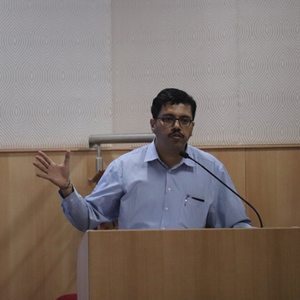

---
hide:
  - toc
---
<!--
CHECKLIST FOR THIS PAGE:
- [ ] Replace [YOUR NAME] with your full name (3 places)
- [ ] Replace [YOUR JOB TITLE] with your current or target role
- [ ] Replace [YOUR TAGLINE] with a short phrase describing your focus
- [ ] Rewrite the About Me paragraph with your own words
- [ ] Replace assets/images/profile.png with your actual photo (keep the filename or update it below)
- [ ] Replace assets/images/about.png with your own image (a field photo, map, or workspace shot)
- [ ] Edit the skill cards to match your actual skills (add, remove, or rename cards as needed)
- [ ] Update GitHub and LinkedIn links in the Connect section
- [ ] Add your CV PDF to docs/assets/ and update the filename in the Download CV button
-->

  
  <h1>Gurudatta K N</h1>
  
<strong>Geospatial Leadership | LiDAR Operations | AI Adoption in Production Systems</strong>

  
<em>I help organizations scale geospatial delivery, operationalize AI in production workflows and solve complex infrastructure challenges at scale.</em>

---

## About Me

With more than 20 years of experience in geospatial technology and LiDAR operations, I have led large-scale delivery programs spanning North America, Europe, Asia and South America. My work focuses on operationalizing geospatial analytics, improving delivery governance and integrating AI-assisted workflows into production environments without compromising quality standards.

Over the years, I have managed airborne and terrestrial LiDAR programs covering hundreds of thousands of square kilometers, built distributed delivery teams and led vendor ecosystems supporting critical infrastructure and utility analytics. My experience combines technical execution with operational leadership across project delivery, workflow optimization, quality assurance and strategic planning.

More recently, my focus has expanded towards production AI adoption in geospatial (LiDAR) workflows, including benchmarking AI-assisted LiDAR classification systems, evaluating delivery efficiency gains and helping organizations transition from traditional processing pipelines to analytics-driven operations.

I am currently engaged in geospatial consulting, market development and applied AI learning while contributing actively to the IEEE Geoscience and Remote Sensing community.

  

---

[View My Projects :material-arrow-right:](projects/index.md){ .md-button .md-button--primary }
[Download CV :material-download:](assets/gurudatta-cv.pdf){ .md-button }

---

## Global Delivery Impact

- **250,000+ sq.km** Airborne LiDAR programs delivered across Europe, Eastern Asia, Australia, and South America.

- **19,000+ km** Airborne Gieger Mode LiDAR based Utility corridor classification supporting critical infrastructure analytics in North America.

- **25+ Engineers** Built and managed distributed geospatial production teams with scalable delivery governance.

- **100+ Vendor Resources** Coordinated multi-vendor operational ecosystems for large geospatial programs.

- **30% Throughput Improvement** Achieved through AI-assisted LiDAR production workflows and process optimization initiatives.

- **20+ Years** Experience spanning geospatial analytics, LiDAR operations, GIS consulting and delivery leadership.

## Skills & Expertise

-   :material-layers:{ .lg .middle } **Geospatial Operations Leadership**

    ---

    - Large-scale geospatial delivery management
    - Distributed team leadership and vendor governance
    - Operational scaling across global delivery programs
    - Workflow optimization and quality assurance frameworks

-   :material-image-filter-hdr:{ .lg .middle } **LiDAR & Terrain Analytics**

    ---

    - Airborne LiDAR (ALS) processing
    - Mobile Terrestrial LiDAR (MTLS)
    - Digital Terrain Model (DTM) generation
    - Utility corridor and infrastructure analytics
    - LiDAR calibration and orthophoto workflows
    - TerraSolid, MicroStation, ArcGIS, QGIS

-   :material-robot-outline:{ .lg .middle } **AI Adoption & Workflow Automation**

    ---

    - AI-assisted classification workflows
    - Production AI evaluation and benchmarking
    - AI governance in live delivery environments
    - Throughput optimization using AI-assisted tooling
    - Python-based automation and analytics

-   :material-clipboard-check-outline:{ .lg .middle } **Program & Delivery Management**

    ---

    - Multi-project execution across international markets
    - Delivery governance and capacity planning
    - Stakeholder communication and reporting
    - Resource planning across in-house and vendor teams
    - Production risk management and QC frameworks

-   :material-transmission-tower:{ .lg .middle } **Infrastructure & Utility Analytics**

    ---

    - Utility corridor classification programs
    - Infrastructure mapping and terrain intelligence
    - Government and enterprise GIS solutions
    - Spatial analytics for operational decision-making

-   :material-account-voice:{ .lg .middle } **Professional & Technical Contributions**

    - IEEE Senior Member (GRSS)
    - Conference organization and technical coordination
    - Industry lectures on GIS and LiDAR technologies
    - Geospatial consulting and market development

---

## Professional Recognition

- IEEE Senior Member, Geoscience and Remote Sensing Society (GRSS)
- Published contributor in IEEE Geoscience and Remote Sensing Magazine (2024)
- Organizing Committee Member for InGARSS-2023
- Speaker and invited lecturer on LiDAR, GIS and geospatial technologies

---
## Connect

[GitHub](https://github.com/geoaiguru){ .md-button }
[LinkedIn](https://linkedin.com/in/grsguru){ .md-button }
