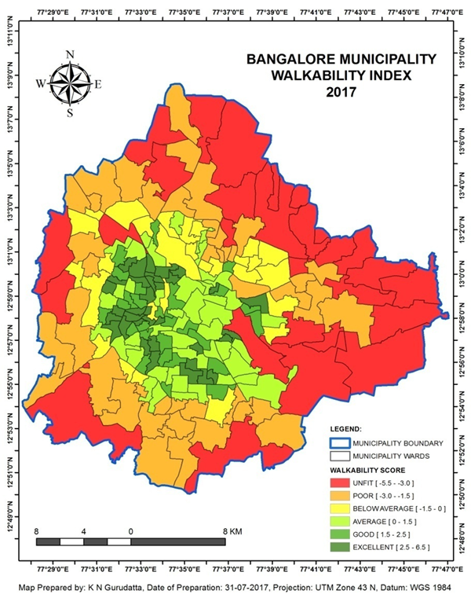

# GIS Approach to Assess Walkability in Bangalore City (M.Sc. Thesis, 2017)
## Overview

This project developed a Walkability Index for Bangalore using GIS-based spatial analysis. It combined population density, land-use diversity, street connectivity, and destination proximity to objectively assess walkability across all municipal wards in ArcGIS. The work produced an evidence-based framework for identifying pedestrian barriers, planning priorities, and urban mobility opportunities in the 2017 context.

**Study Area:** Bangalore City, India  
**Duration:** 2017  
**Role:** M.Sc. Thesis Research  
**Status:** Completed  

---
''''''

## Methods & Tools

**Data Sources**
- Publicly available spatial and demographic datasets for Bangalore
- Ward-level administrative boundaries
- Land-use, street network, and destination datasets compiled from multiple public sources

**Processing Steps**
1. Collected and integrated multi-source public datasets.
2. Standardized spatial layers and normalized built environment indicators.
3. Modeled walkability using population density, land-use diversity, street connectivity, and destination proximity.
4. Evaluated ward-level patterns to identify barriers and opportunities for pedestrian-friendly planning.

**Tools Used**

| Tool | Purpose |
|------|---------|
| ArcGIS | Spatial analysis and index construction |
| GIS data processing workflows | Data integration and normalization |
| Statistical / geospatial modeling | Indicator scoring and comparison across wards |

---

## Key Findings

- Generated a ward-level Walkability Index for Bangalore using objective spatial indicators.
- Identified neighborhoods with stronger pedestrian-supportive urban form and areas with structural walkability deficits.
- Demonstrated a replicable GIS framework that can be adapted for other Indian cities.
- Supported pedestrian-friendly planning and urban mobility assessment in the 2017 context.

---

## Impact

The thesis provided evidence-based recommendations for improving urban walkability and pedestrian planning in Bangalore. It also established a reusable analytic template for evaluating walkability in other Indian cities. Since 2017, urban transformation and policy shifts may have altered local walkability conditions, so the findings should be read as a historical baseline rather than a current assessment.

---

<!--## Links

[View Thesis](../assets/images/blr-walk-2017.png){ .md-button } -->
